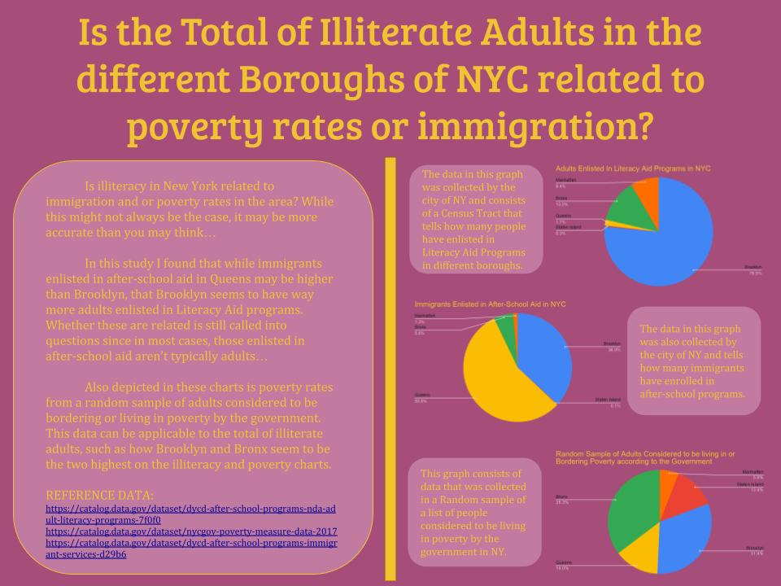

# Data analysis in Python

This was a highschool Python class project and had to do with translating data in the form of a csv file and turning that into readable graphs. Additionally, the project included the making of an infographic that provides more insight on the comparing of the graphs. 

**NOTE** this data is pretty old and the links may be expired, but the data I used at the time is available in the csv files provided.

# Resources

adult literacy in NYC data:
https://catalog.data.gov/dataset/dycd-after-school-programs-nda-adult-literacy-programs-7f0f0

list of borough locations with phone numbers:
https://data.cityofnewyork.us/Education/DYCD-after-school-programs-NDA-Adult-Literacy-Prog/ia9u-k3t3/data

poverty in NYC dataset (2017):
https://catalog.data.gov/dataset/nycgov-poverty-measure-data-2017

details about the poverty in NYC dataset:
https://catalog.data.gov/dataset/nycgov-poverty-measure-data-2017
https://www1.nyc.gov/assets/opportunity/pdf/19_poverty_measure_report.pdf

after-school services for immigrants:
https://catalog.data.gov/dataset/dycd-after-school-programs-immigrant-services-d29b6